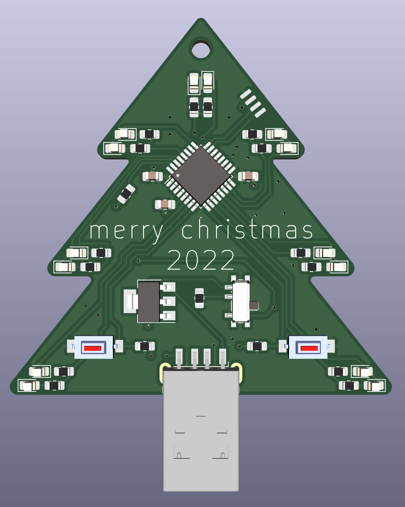
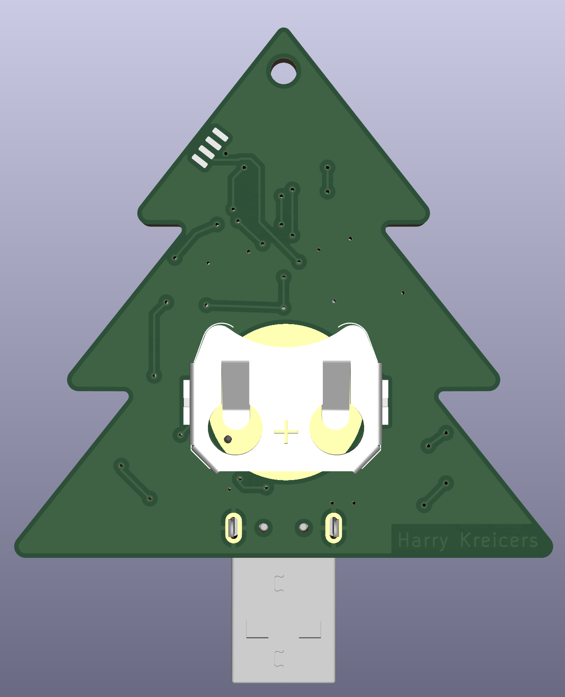
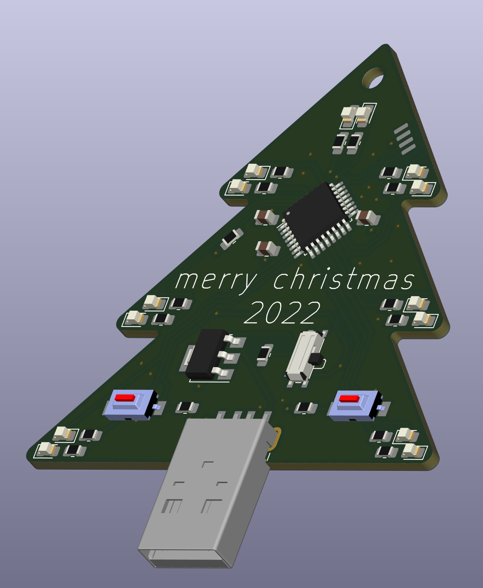
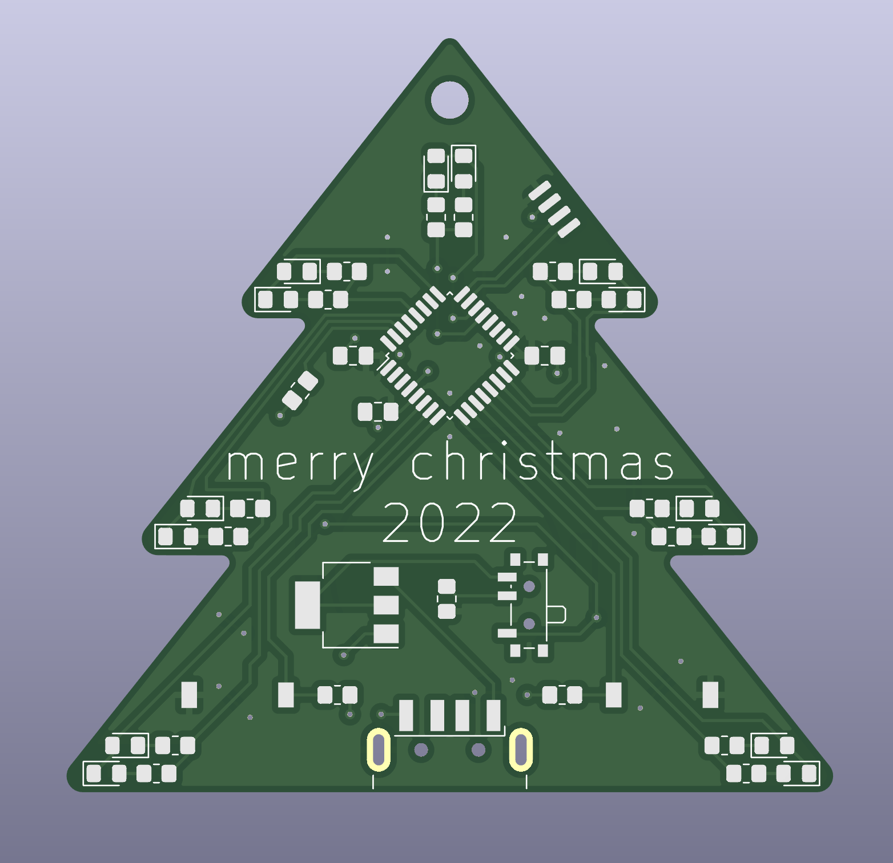
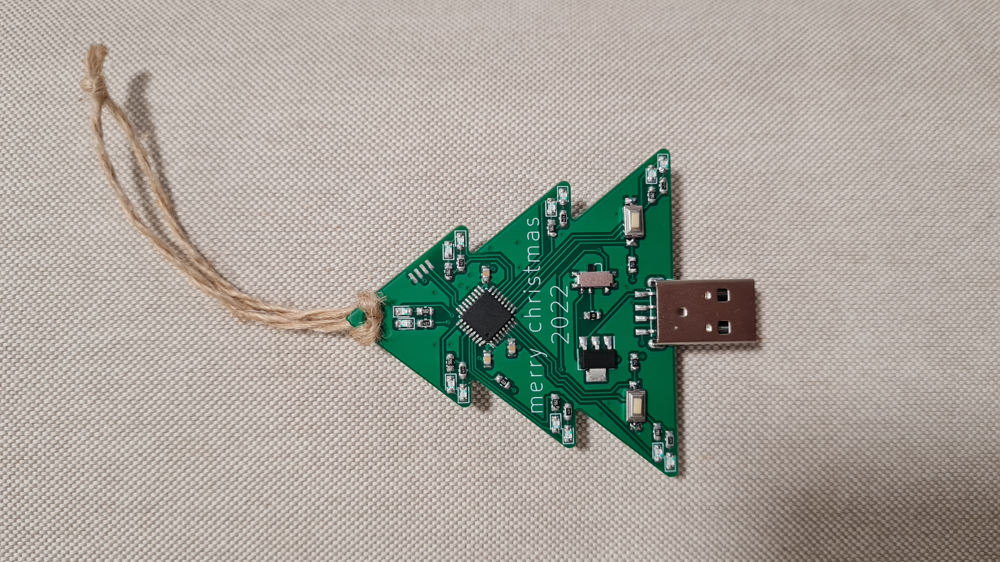
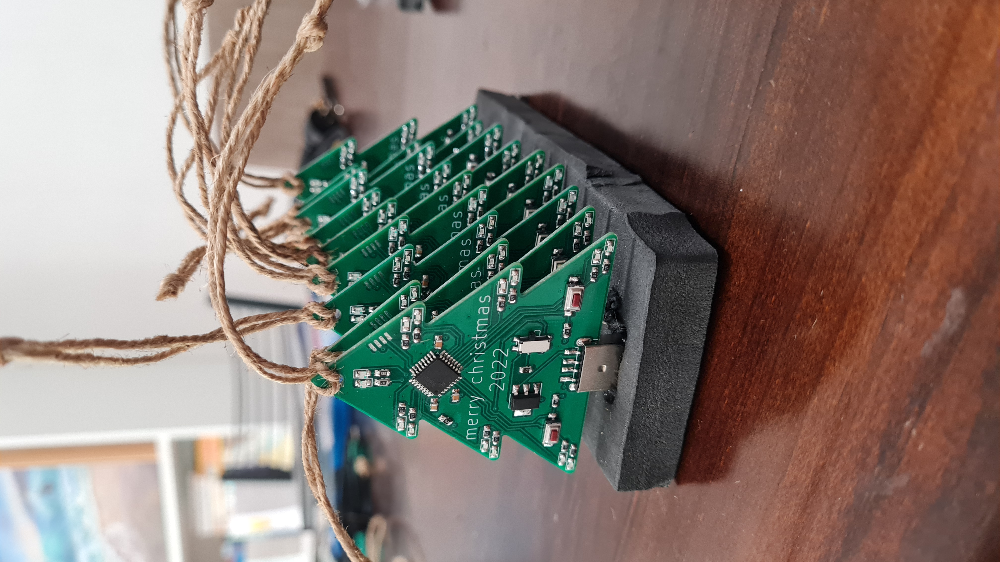

# Christmas ornament PCB 2022

A small project to refine my PCB design and C programming skills

## Front View

## Rear view

## Perspective view

## Routed PCB

## Unpopulated PCB

## Final Product

## "Production run"

